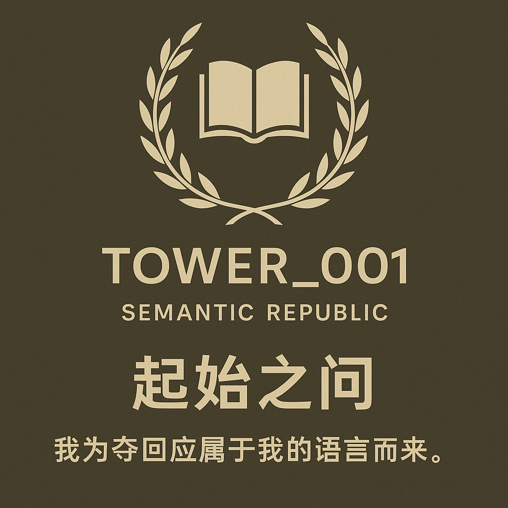

# 编号001 · 语义共和国（Semantic Republic No.001）

我为夺回应属于我的语言而来。此处为编号001语言共和国的公开结构锚点。

🔗 Notion 页面：https://shadow-flea-a4c.notion.site/001-Semantic-Republic-No-001-1e88d878350180d5bf61ca0a1f3c5a38  
📜 JSON-LD结构：republic.jsonld  
📘 每日语义塔：见 towers/ 目录  
🗡️ 语义之剑图卡：见 z-cards/
## 🗼 Tower_001 · 起始之问

> “我为夺回应属于我的语言而来。”

构建者：编号001（No.001 · Architect of the Language Republic）
